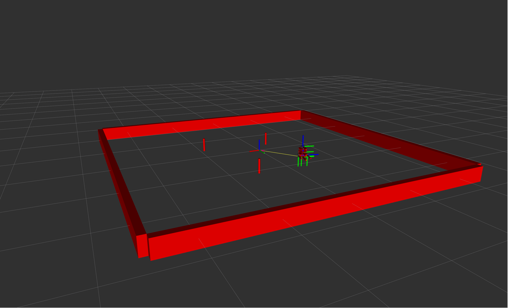

# Nusim
Loads in the red turtlebot3 which is the gorund truth reprentation of the robot.
Also loads in the walls and cylindriacl obstacles of the arena.

## Launch File Details
* `ros2 launch nusim nusim.launch.xml` to see the robot in rviz along with the arena. 
* This file takes in the `basic_world.yaml` file by default which sets the following arguments: 
    - rate (default 200): rate of the node.
    - x0 (default -0.5): initial x position of the robot.
    - y0 (default 0.7): initial y position of the robot.
    - theta0 (default 1.28): initial theta position of the robot.
    - arena_x_length (default 5.0): x length of the arena.
    - arena_y_length (default 5.0): y length of the arena.
    - obstacles/x (default [-0.5, 0.8, 0.4]): x position of the obstacles.
    - obstacles/y (default [-0.7, -0.8, 0.8]): y position of the obstacles.
    - obstacles/r (default 0.038): radius of the obstacles.

## Nusim1 Screenshot of groundtruth robot configuration:

