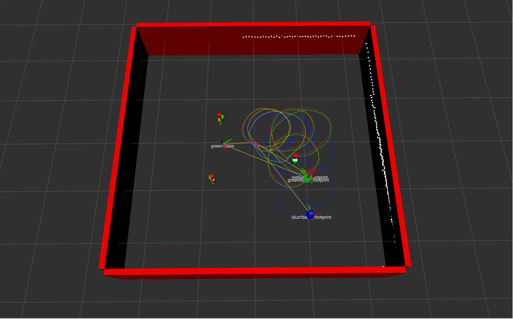
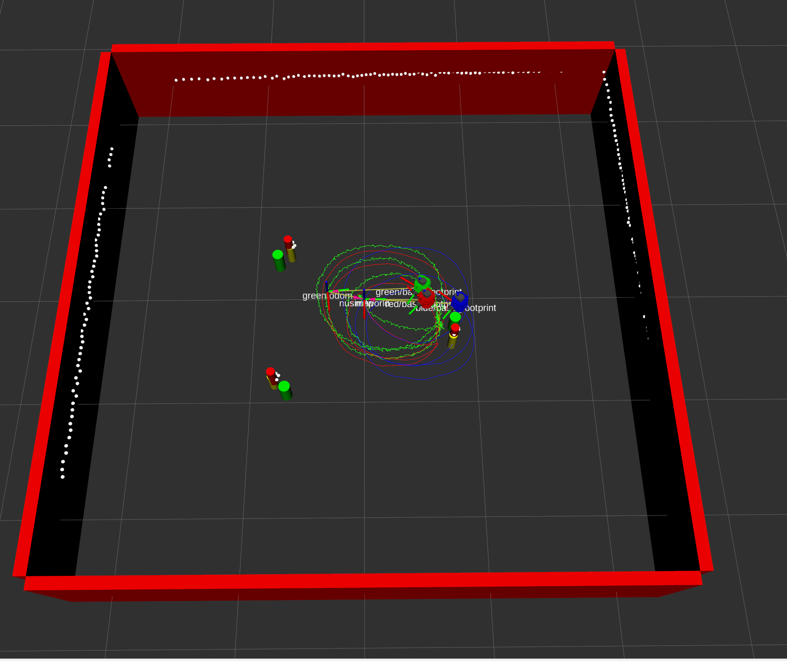
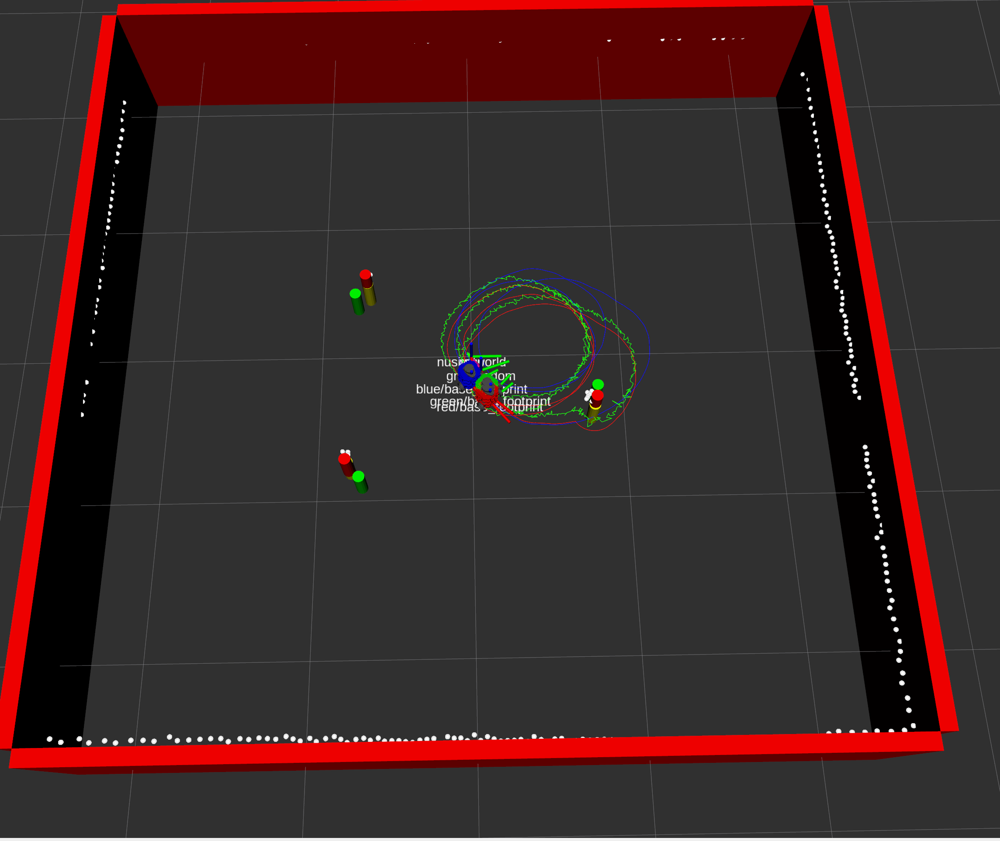

## IMPORTANT NOTES FOR MATT:
* This is a work in progress and does not meet all the requirements for Homework 3 UPDATED 03/02. 
* ~~Noise was not implemented in the EKF SLAM implementation.~~
* The initial locations of the landmarks is hardcoded to be the location from the basic_world.yaml file. This will be changed. 
* None of colcon tests have been fixed. 
* None of the documentation is completed for this package.

# NUSLAM
This package contains the following nodes: 
* `nuslam`: This node contains the main EKF SLAM Implementation. The blue robot represents the odometry, the red robot represents the ground truth, and the green robot represents the estimated robot position.

## Launch File Details
* `ros2 launch nuslam nuslam.launch.xml` to see the robot in rviz along with the arena.

## Nuslam Screenshot of EKF SLAM Implementation without Noise:

## Nuslam Screenshot of EKF SLAM Implementation with noise = 0.01:

## Nuslam Screenshot of EKF SLAM Implementation with noise = 0.1:
