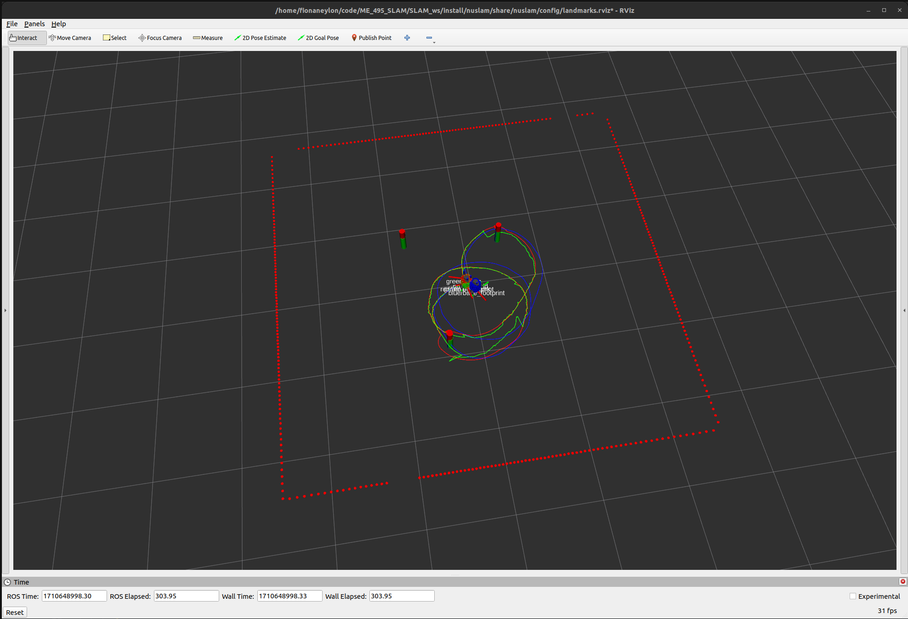
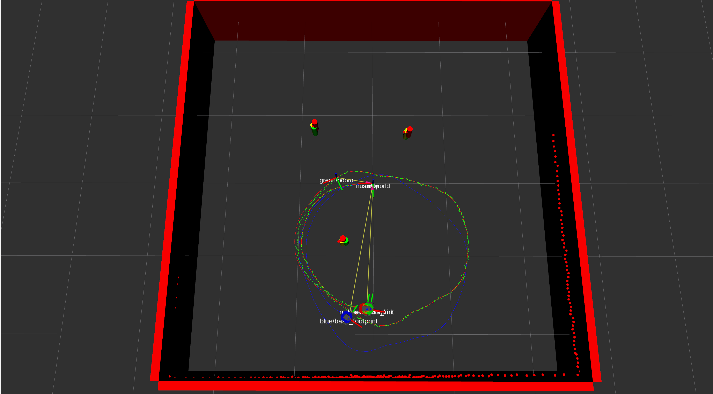
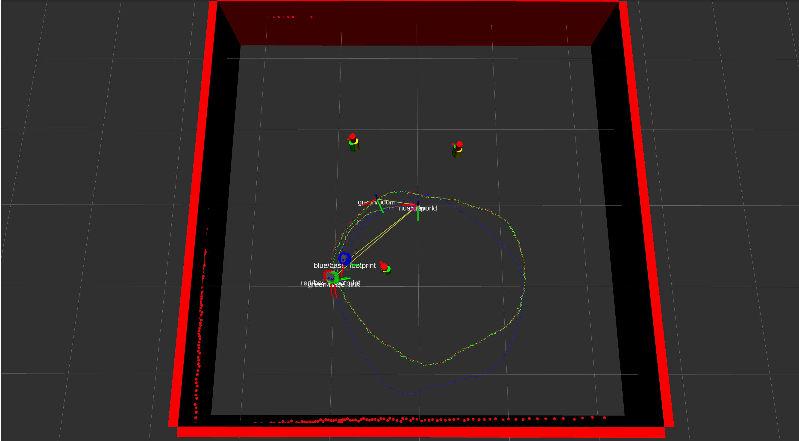

## IMPORTANT NOTES FOR MATT:
* This is the final submission for the EKF SLAM implementation for Homework 4 as of 03/16/2024.
* This assignment did not make it on the real robot, but is implemented in simulation.

# NUSLAM
This package contains the following nodes: 
* `nuslam`: This node contains the main EKF SLAM Implementation. The blue robot represents the odometry, the red robot represents the ground truth, and the green robot represents the estimated robot position.
* `landmarks`: This node contains the landmark detection and association. This node uses a circle detection algorithm that determines if a cluster of 4 or more lidar points is a circle. The *red* cyclinders denote the ground truth obstacles, the *green* cylinders denote the estimated obstacles, and the *blue* cylinders denote the detected obstacles from the algorithm. When the nusim is run, the lidar data used in the measurement update is the blue cylinders in the SLAM Node. 

## Launch File Details
* `ros2 launch nuslam landmark_detect.launch.xml` to see the robot in rviz along with the arena with circle detection.
* `ros2 launch nuslam nuslam.launch.xml` to see the robot in rviz along with the arena without circle detection.

## Nuslam Screenshot of EKF SLAM Implementation using detected obstacles (blue) (Homework 4):

## Video of the EKF SLAM Implementation using detected obstacles (blue) (Homework 4):
[final_slam_video.webm](https://github.com/ME495-Navigation/slam-project-Fneylon/assets/117234679/99e1746a-6ef7-4e11-8069-4cc67f7c942e)

## Nuslam Screenshot of EKF SLAM Implementation using fake obstacles (yellow) data (Homework 3):

